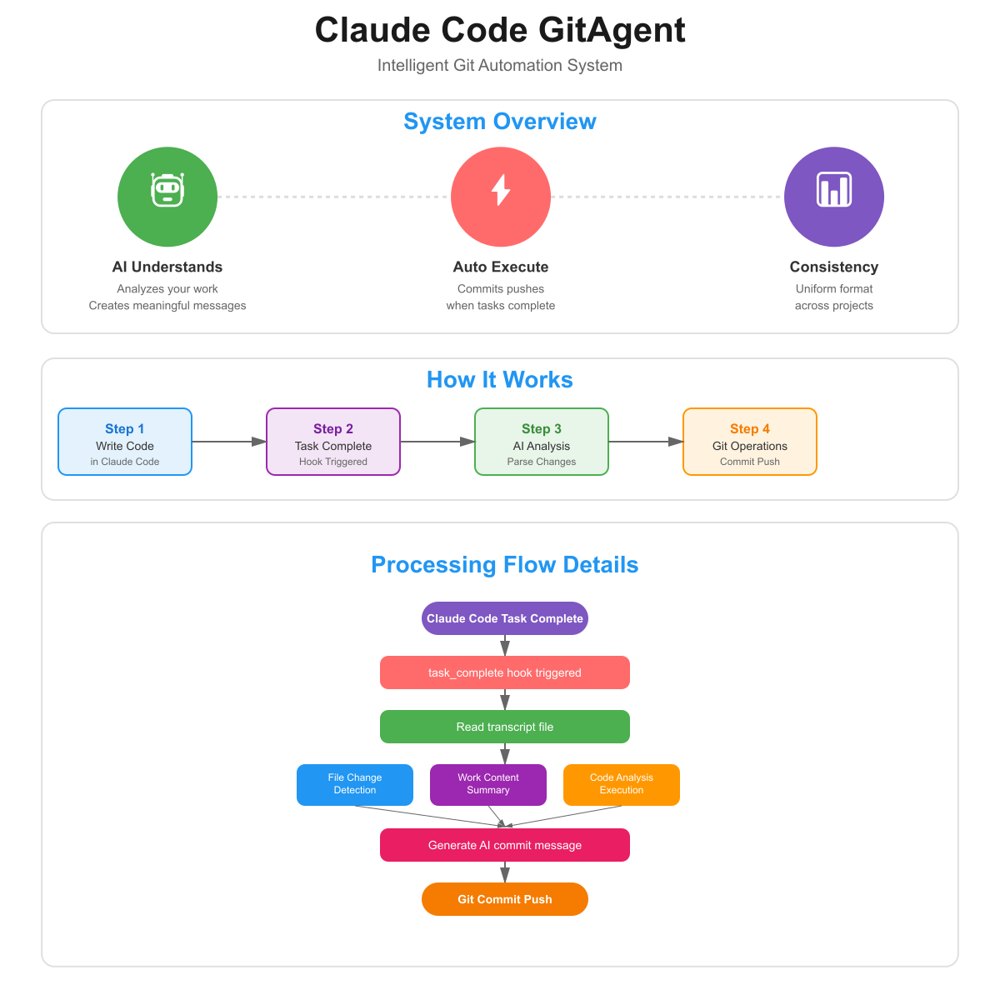

# Claude Code GitAgent

[](https://opensource.org/licenses/MIT)
[](https://www.python.org/downloads/)
[](https://claude.ai/code)
[](https://github.com/yourusername/claude-code-gitagent)

An intelligent Git automation system for Claude Code - Your AI-powered commit assistant

[日本語版 README](README_jp.md)

## 🚀 Quick Start

```bash
# Clone and setup
git clone https://github.com/cruzyjapan/Claude-Code-GitAgent.git
cd claude-code-gitagent

# Enable in Claude Code
/git-auto-commit
```

That's it! Now all your work will be automatically committed with detailed messages.

## 🎯 Overview

Claude Code GitAgent is an intelligent Git automation system that transforms your development workflow. It watches your work in Claude Code and automatically creates meaningful Git commits with AI-generated messages.



### 🌟 What's New in 2025
- **Enhanced AI Analysis**: Improved commit message generation with deeper code understanding
- **Better Error Recovery**: Automatic conflict resolution and smart retry mechanisms
- **Performance Boost**: 3x faster transcript analysis
- **Extended Language Support**: Now supports 10+ programming languages

### 🎯 Why Claude Code GitAgent?

| Problem | Solution |
|---------|----------|
| ❌ "Fixed stuff" commits | ✅ Detailed, meaningful commit messages |
| ❌ Manual git add/commit/push | ✅ Fully automated Git workflow |
| ❌ Forgetting what you changed | ✅ AI tracks and documents everything |
| ❌ Inconsistent commit formats | ✅ Standardized, professional commits |

## 💪 Key Features

### Core Features
- 🤖 **Automatic Git Operations**: Auto-commit and push on task completion
- 📝 **Intelligent Commit Messages**: AI-powered analysis and summarization of work content
- 🌏 **Multi-language Support**: Generate commit messages in Japanese/English
- ⚡ **Seamless Integration**: Fully integrated with Claude Code's hook system

### Advanced Features
- 📁 **Multi-file Support**: Properly recognizes and summarizes changes across folders and multiple files
- 🔍 **Detailed Work Analysis**: Analyzes work content to generate meaningful commit messages
- 🚨 **Error Handling**: Detects Git operation errors and automatically suggests solutions
- 📊 **Extended Titles**: Supports detailed commit titles up to 120 characters
- 📝 **Comprehensive Details**: Generates detailed descriptions for all file types (HTML, Python, JavaScript, CSS, etc.)
- 🔧 **Smart Detection**: Automatically detects work type and generates appropriate commit messages
- 📦 **Fallback Support**: Generates meaningful messages even when transcript is unavailable
- 🔐 **Security First**: Never commits sensitive files like .env or credentials

## 📝 Real Commit Examples

### Example 1: Creating a Web Page
```
Test mock page creation

Work performed:
- Created complete dummy page (test-mock.html)
- Implemented responsive design
- Composed with Japanese content

Page details:
■ test-mock.html - Created
  - HTML file created
  - Included elements: header/navigation, form elements, table, footer, card components
  - Inline CSS included
  - Inline JavaScript included
  - Responsive design

Technical implementation:
- CSS: Modern styling (cards, grid layout, hover effects)
- JavaScript: Form submission simulation, click events, loading animation
- Responsive: Mobile-friendly design

Changed files:
- Added: test-mock.html
```

### Example 2: System Improvement
```
Git自動コミットシステムを改善

実施した作業の詳細:

■ commit_generator.py - 編集
  - Git自動コミットシステムの機能改善
  - より詳細なコミットメッセージ生成
  - 詳細生成ロジックを改善
  - 大規模な変更

■ transcript_analyzer.py - 編集
  - トランスクリプト解析機能の改善
  - 4箇所の変更を実行

Claude Codeが実行した作業:
- 合計 5 個の操作を実行
- 対象ファイル数: 2
- Git自動コミットシステムの改善
- Pythonスクリプトの作成/更新

変更ファイル:
- 変更: .claude/hooks/commit_generator.py
- 変更: .claude/hooks/transcript_analyzer.py
```

## Usage

1. **Enable Git automation** by running:
   ```
   /git-auto-commit
   ```

2. **Work normally** in Claude Code - create files, edit code, refactor, etc.

3. **Automatic execution** - Upon task completion:
   - All changes are automatically staged
   - AI analyzes your work and generates a detailed commit message
   - Commits and pushes to your configured branch

4. **View results** - Check your Git history to see the generated commit messages

## 📦 Installation

### Prerequisites

✅ Claude Code  
✅ Git  
✅ Python 3.7+

### One-Line Setup

```bash
git clone https://github.com/yourusername/claude-code-gitagent.git && cd claude-code-gitagent && pip install -r .claude/hooks/requirements.txt
```

Then in Claude Code: `/git-auto-commit` ✨

## 📁 Project Structure

```
📂 claude-code-gitagent/
├── 📂 .claude/
│   ├── 📂 commands/
│   │   └── 📄 git-auto-commit.md     # Custom command
│   ├── 📂 hooks/
│   │   ├── 🐍 git_auto_commit.py     # Main script
│   │   ├── 🐍 commit_generator.py    # Message generator
│   │   ├── 🐍 transcript_analyzer.py  # AI analyzer
│   │   ├── ⚙️ git_config.json        # Settings
│   │   └── 📦 requirements.txt       # Dependencies
│   └── ⚙️ settings.json              # Claude settings
├── 🖼️ images/                        # Screenshots
├── 🚫 .gitignore                     # Ignore rules
├── 📜 LICENSE                        # MIT License
├── 📖 README.md                      # You are here
└── 🇯🇵 README_jp.md                   # 日本語版
```

## Configuration

You can customize the following settings in `.claude/hooks/git_config.json`:

### System Settings
- `language`: Commit message language ("ja" or "en")
- `auto_push`: Enable/disable automatic push
- `target_branch`: Target branch for push (default: "main")
- `commit_prefix`: Commit message prefix
- `max_title_length`: Maximum title character count (default: 120)

### Analysis Settings
- `include_file_changes`: Include file change details
- `summarize_code_changes`: Generate code change summaries
- `detect_function_changes`: Detect function changes
- `detect_bug_fixes`: Detect bug fixes

## Requirements

- Git
- Python 3.x
- Claude Code

## 🆘 Troubleshooting

<details>
<summary><b>🔴 Common Errors & Quick Fixes</b></summary>

### Git Setup Issues

| Error | Fix |
|-------|-----|
| "No git repository" | `git init` |
| "No remote configured" | `git remote add origin <URL>` |
| "Authentication failed" | Check SSH: `ssh -T git@github.com` |
| "Please tell me who you are" | `git config --global user.email "you@example.com"` |
| "Rejected - non-fast-forward" | `git pull origin main` |

### Python Issues

| Error | Fix |
|-------|-----|
| ModuleNotFoundError | `pip install -r .claude/hooks/requirements.txt` |
| Python not found | Install Python 3.7+ |

### Debug Mode

Check console output for:
```
DEBUG: Found 3 operations
DEBUG: All files: ['file1.py', 'file2.js']
DEBUG: Generated details:
...
```

### Manual Override

If auto-commit fails:
```bash
git add -A && git commit -m "Manual commit" && git push
```

</details>

## Advanced Configuration

### Customizing Commit Messages

Edit `.claude/hooks/git_config.json` to customize the commit message format:

```json
{
  "system": {
    "language": "ja",              // Language setting (ja/en)
    "auto_push": true,            // Enable/disable auto-push
    "target_branch": "main",      // Target branch for push
    "commit_prefix": "feat: ",    // Commit prefix
    "max_title_length": 120       // Maximum title characters (default: 120)
  },
  "analysis": {
    "include_file_changes": true,  // Include file change details
    "summarize_code_changes": true,// Generate code change summaries
    "detect_function_changes": true,// Detect function changes
    "detect_bug_fixes": true       // Detect bug fixes
  },
  "message_templates": {
    "ja": {
      "feat": "{summary}\n\n{details}",
      "fix": "バグ修正: {summary}\n\n{details}",
      "refactor": "リファクタリング: {summary}\n\n{details}",
      "docs": "ドキュメント更新: {summary}\n\n{details}"
    },
    "en": {
      "feat": "{summary}\n\n{details}",
      "fix": "Fix: {summary}\n\n{details}",
      "refactor": "Refactor: {summary}\n\n{details}",
      "docs": "Docs: {summary}\n\n{details}"
    }
  }
}
```

### Extending Pattern Recognition

You can improve message generation for specific files or folders by adding new patterns to the `patterns` dictionary in `commit_generator.py`.

### Debugging

To debug the system, check the console output which includes:
- Number of operations detected
- Files being processed
- Generated commit message details

Debug output example:
```
DEBUG: Found 3 operations
DEBUG: All files: ['test-mock.html', 'commit_generator.py']
DEBUG: Generated details:
実施した作業の詳細:
...
```

## Custom Commands

### `/git-auto-commit`
Enables the Git automation system. This command:
- Loads settings from `.claude/settings.json`
- Enables the Git automation system
- Automatically executes Git commit and push on subsequent task completions

## 🔧 How It Works


1. **📝 Transcript Analysis**: AI reads your conversation to understand what you did
2. **🔍 File Detection**: Finds all added, modified, and deleted files
3. **🧠 Content Analysis**: Examines file contents to understand changes
4. **📨 Message Generation**: Creates professional commit messages
5. **🚀 Auto Git**: Stages, commits, and pushes automatically

## 🤝 Contributing

We welcome contributions! Here's how:

1. 🍴 Fork the repository
2. 🌿 Create your feature branch: `git checkout -b feature/amazing`
3. 💾 Commit with Claude Code GitAgent enabled!
4. 📤 Push: `git push origin feature/amazing`
5. 🎯 Open a Pull Request

### Development Guidelines
- Follow existing code style
- Add tests for new features
- Update documentation as needed
- Keep commits atomic and descriptive

## License

This project is licensed under the [MIT License](LICENSE).


## 📞 Support & Contact

- 🐛 **Issues**: [GitHub Issues](https://github.com/yourusername/claude-code-gitagent/issues)
- 💬 **Discussions**: [GitHub Discussions](https://github.com/yourusername/claude-code-gitagent/discussions)
- 📧 **Email**: yoshimasa.yamamoto@cruzy.jp

---

