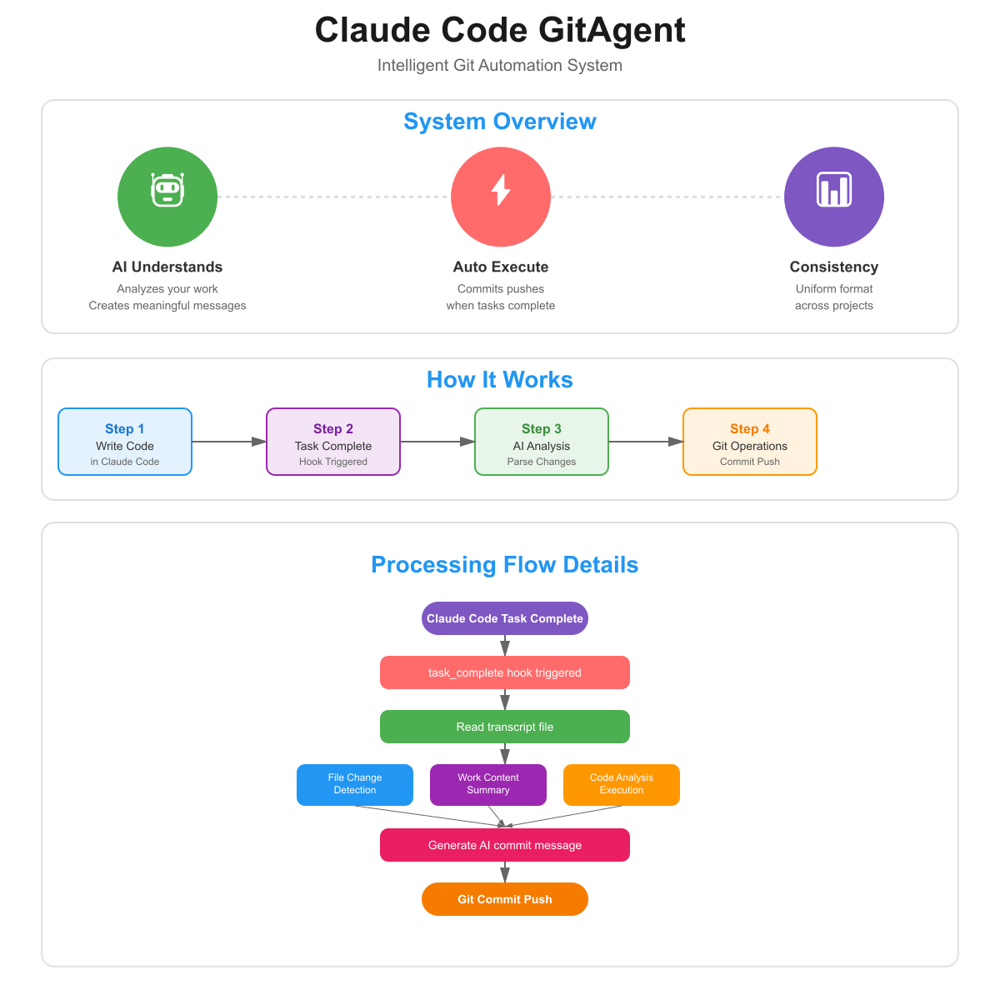

# Claude Code GitAgent

[](https://opensource.org/licenses/MIT)
[](https://www.python.org/downloads/)
[](https://claude.ai/code)

Claude Code用のインテリジェントなGit自動連携システム

## 概要

Claude Code GitAgentは、Claude Codeでの開発作業を効率化するためのインテリジェントなGit自動連携システムです。タスク完了時に自動的にGitコミット・プッシュを実行し、AIがトランスクリプトから作業内容を分析して、意味のあるコミットメッセージを生成します。



### なぜClaude Code GitAgent？

- **コミットメッセージに悩まない**: AIが作業内容を理解し、適切なメッセージを自動生成
- **作業に集中**: Git操作を意識せず、開発に専念できる
- **一貫性のある履歴**: プロジェクト全体で統一されたコミットメッセージ形式

## 主な機能

- 🤖 **自動Git操作**: タスク完了時に自動でコミット・プッシュ
- 📝 **インテリジェントなコミットメッセージ**: AIによる作業内容の分析と要約
- 🌏 **多言語対応**: 日本語/英語でのコミットメッセージ生成
- ⚡ **シームレスな統合**: Claude Codeのフックシステムと完全統合
- 📁 **複数ファイル対応**: フォルダや複数ファイルの変更も適切に認識・要約
- 🔍 **詳細な作業分析**: 作業内容を解析し、意味のあるコミットメッセージを生成
- 🚨 **エラーハンドリング**: Git操作のエラーを検出し、対処方法を自動提示
- 📊 **拡張タイトル**: 最大120文字までの詳細なコミットタイトルをサポート

## 動作例


### Before（手動コミット）
```
git commit -m "fix"
git commit -m "update files"
git commit -m "changes"
```

### After（Claude Code GitAgent）
```
Git自動コミットシステムを改善

実施した作業:
- トランスクリプト解析機能を改善
- コミットメッセージ生成ロジックを最適化
- デバッグ出力を追加して問題診断を改善

変更ファイル:
- 編集: transcript_analyzer.py
- 編集: commit_generator.py
- 編集: git_auto_commit.py
```

## 使い方

1. Claude Codeで通常通り開発作業を行う
2. タスク完了時に自動的にGitコミット・プッシュが実行される
3. コミットメッセージはAIが作業内容から自動生成

## インストール

### 前提条件

- Claude Code がインストールされていること
- Git がインストールされていること
- Python 3.7 以上

### セットアップ手順

1. **リポジトリをクローン**

```bash
git clone https://github.com/cruzyjapan/Claude-Code-GitAgent.git
cd claude-code-gitagent
```

2. **必要な依存関係をインストール**

```bash
pip install -r .claude/hooks/requirements.txt
```

3. **Claude Codeで設定を有効化**

Claude Codeで以下のコマンドを実行:

```
/git-auto-commit
```

以上で設定完了です！

## プロジェクト構造

```
claude-code-gitagent/
├── .claude/
│   ├── commands/
│   │   └── git-auto-commit.md     # カスタムコマンド定義
│   ├── hooks/
│   │   ├── git_auto_commit.py     # メインフックスクリプト
│   │   ├── commit_generator.py    # コミットメッセージ生成
│   │   ├── transcript_analyzer.py  # トランスクリプト解析
│   │   ├── git_config.json        # Git連携設定
│   │   └── requirements.txt       # Python依存関係
│   └── settings.json              # Claude Code設定
├── images/                        # ドキュメント用画像
├── .gitignore                     # Git除外設定
├── LICENSE                        # MITライセンス
├── README.md                      # 英語版README
└── README_jp.md                   # このファイル
```

## 設定のカスタマイズ

`.claude/hooks/git_config.json`で以下の設定が可能:

### システム設定
- `language`: コミットメッセージの言語（"ja" または "en"）
- `auto_push`: 自動プッシュの有効/無効
- `target_branch`: プッシュ先ブランチ（デフォルト: "main"）
- `commit_prefix`: コミットメッセージのプレフィックス
- `max_title_length`: コミットタイトルの最大文字数

### 解析設定
- `include_file_changes`: ファイル変更の詳細を含める
- `summarize_code_changes`: コード変更の要約を生成
- `detect_function_changes`: 関数の変更を検出
- `detect_bug_fixes`: バグ修正を検出

## 必要な環境

- Git
- Python 3.x
- Claude Code

## トラブルシューティング

### Git関連のエラー

#### エラー: "No git repository found"
```bash
git init
```

#### エラー: "No remote repository configured"
```bash
git remote add origin <URL>
```

#### エラー: "Authentication failed"
- **SSH鍵の設定を確認**:
  ```bash
  ssh -T git@github.com
  ```
- **Personal Access Token (PAT) を使用している場合**:
  ```bash
  git config --global credential.helper store
  ```

#### エラー: "Please tell me who you are"
```bash
git config --global user.email "you@example.com"
git config --global user.name "Your Name"
```

#### エラー: "rejected - non-fast-forward"
リモートに新しい変更があります：
```bash
git pull origin main
# コンフリクトがある場合は解決してから再度コミット
```

#### エラー: "does not exist"
リモートブランチが存在しない場合：
```bash
git push -u origin main
```

### Python関連のエラー

#### ModuleNotFoundError
```bash
pip install -r .claude/hooks/requirements.txt
```

### Claude Code GitAgent固有のエラー

#### デバッグ出力の確認
`git_auto_commit.py`にデバッグ出力が含まれています。エラー時は以下を確認：
- トランスクリプトパス
- operations データ
- 生成されたコミットメッセージ

#### 手動でのGit操作
自動コミットが失敗した場合、手動で実行：
```bash
git add -A
git commit -m "メッセージ"
git push origin main
```

## 高度な設定

### コミットメッセージのカスタマイズ

`.claude/hooks/git_config.json`を編集して、コミットメッセージの形式をカスタマイズできます：

```json
{
  "system": {
    "language": "ja",              // 言語設定（ja/en）
    "auto_push": true,            // 自動プッシュの有効/無効
    "target_branch": "main",      // プッシュ先ブランチ
    "commit_prefix": "feat: ",    // コミットプレフィックス
    "max_title_length": 120       // タイトルの最大文字数（デフォルト: 120）
  }
}
```

### パターン認識の拡張

`commit_generator.py`の`patterns`辞書に新しいパターンを追加することで、特定のファイルやフォルダに対するメッセージ生成を改善できます。

## カスタムコマンド

### `/git-auto-commit`
Git自動連携システムを有効化します。このコマンドは：
- `.claude/settings.json`の設定を読み込む
- Git自動連携システムを有効化
- 以降のタスク完了時に自動的にGitコミット・プッシュを実行

## 貢献

プルリクエストを歓迎します！大きな変更を行う場合は、まずissueを開いて変更内容について議論してください。

1. フォーク
2. フィーチャーブランチを作成 (`git checkout -b feature/AmazingFeature`)
3. 変更をコミット (`git commit -m 'Add some AmazingFeature'`)
4. ブランチにプッシュ (`git push origin feature/AmazingFeature`)
5. プルリクエストを開く

## ライセンス

このプロジェクトは[MITライセンス](LICENSE)の下で公開されています。
